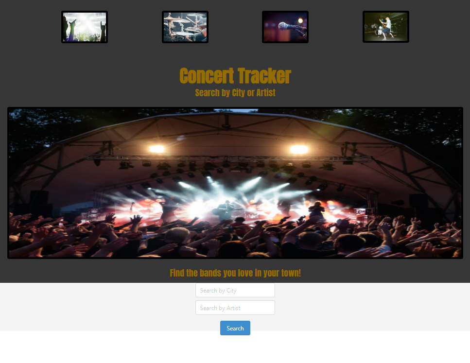

# Concert-Tracker

## Our Task

We created an application for music lovers to track concert locations based on the band.

## User Story
```
AS a music fan I want to be able to find concerts in my area based on the artist or artist and location that I search
```

## Acceptance Criteria
```
GIVEN when I open the webpage 
THEN I am presented with a location search field
WHEN I am presented with an artist search field
THEN I can enter search criteria
THEN I get results back information for their next five concerts including: artist name, artist image, city, state, location map, and a link to buy tickets from ticketmaster 
```

## Mock-Up
```
Our wireframe for the home page and search results page can be found [here](./assets/image/concert%20tracker%20mockup.png)

```

## Review

## Collaborators

Here are the awesome collaborators and a link to their additional work: 
* Billy [link](https://github.com/Bfinch3)
* Pam [link](https://github.com/pcrainer38)
* Andy [link](https://github.com/AndyBakhaya)
* Kevin [link](https://github.com/kevin6314/)

